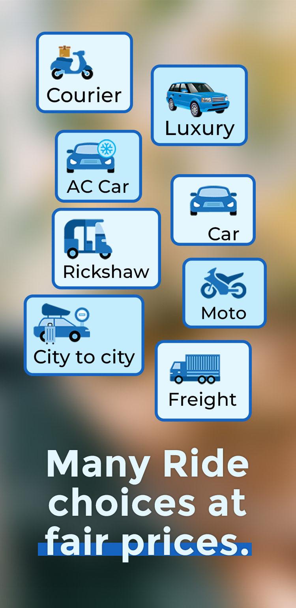
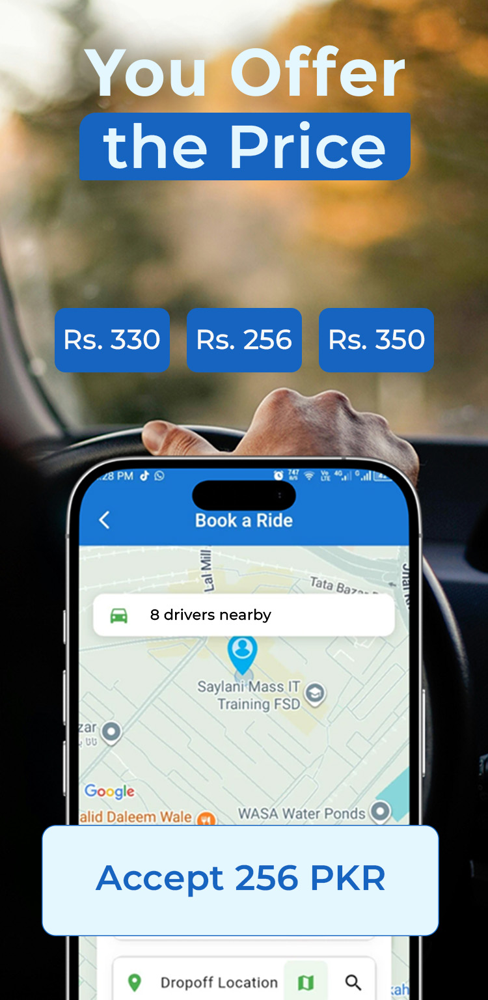
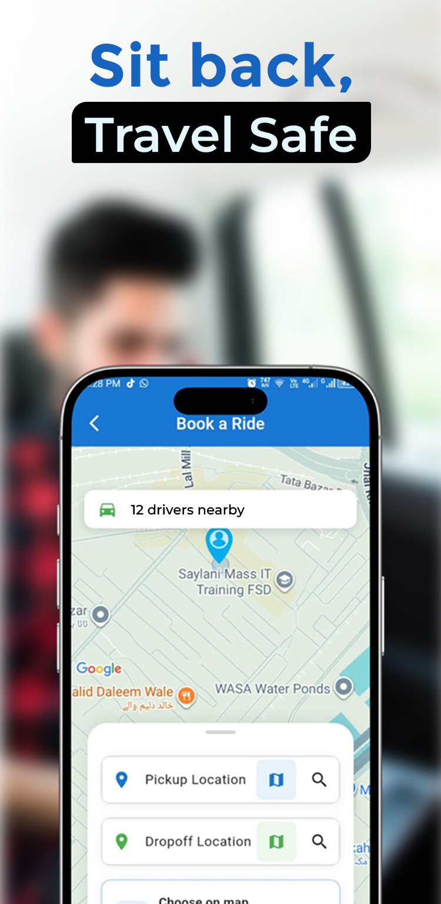
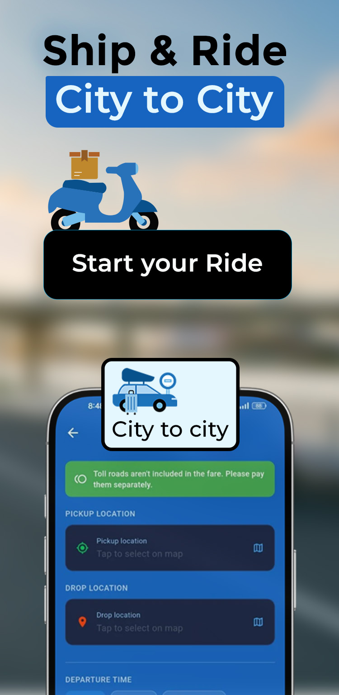
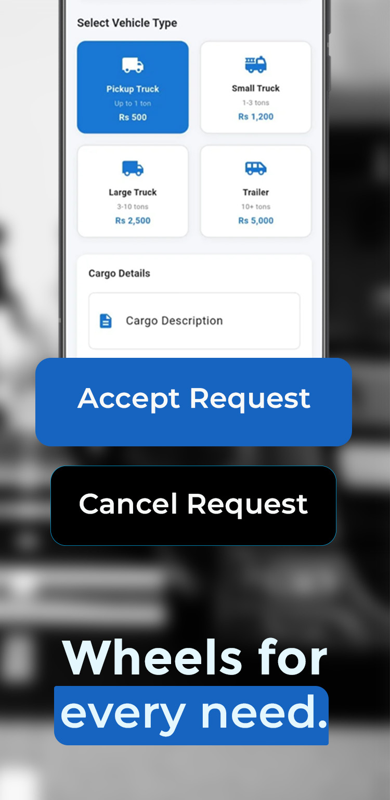

# 🚗 DriveNow
### Ride-Hailing Platform for Pakistan

A production ride-hailing app — live on Google Play — with real-time fare bidding, live driver tracking, and local payment integration (JazzCash).

---

> **📌 Note:** This is a portfolio showcase of DriveNow's architecture and my individual contributions. Live production code, secrets, and credentials are not included here. DriveNow is a live app serving real riders and drivers in Faisalabad, Pakistan.

 

## 📱 What It Does

DriveNow connects riders and drivers with an **inDriver-style bidding model** — riders propose a fare, nearby drivers accept or counter — plus:

| | |
|---|---|
| 🎯 | Real-time driver location tracking with live map updates |
| 📞 | In-app voice calling between rider and driver (WebRTC) |
| 💳 | Local payment methods — JazzCash MWallet, Easypaisa, in-app wallet |
| 🌆 | City-to-city rides and courier/freight requests |
| ✅ | Driver KYC verification workflow |
| 📊 | Admin dashboard for revenue and operations |

**🟢 Live in Production on Google Play (Pakistan) · v1.5.15+26**

 

## 🛠 Tech Stack

| Layer | Tech |
|---|---|
| 📱 Mobile app | Flutter, Riverpod, GoRouter |
| ☁️ Backend | Firebase Cloud Functions, Firestore |
| ⚡ Real-time | WebRTC (calling), Firestore listeners (live tracking) |
| 🗺️ Maps | Google Maps SDK, custom Haversine ETA (cost-optimized) |
| 💳 Payments | JazzCash MWallet v2.0 (server-side HMAC-SHA256 verification) |
| 🔐 Auth | Custom OTP service (SendPK), migrating to backend-issued JWT |
| 🔔 Push | Firebase Cloud Messaging |

 

## 🏗 Architecture Highlights

Real engineering problems solved in this project:

### 💳 1. Payment Reliability (JazzCash)
Diagnosed a silent failure where charge requests never reached the server — root-caused to an App Check stub that never activated, combined with a hard block on token readiness. Fixed by making the check advisory (matching the pattern already working in the OTP service) — restored payments in production with **zero downtime**.

### 🗺️ 2. Google Maps Cost Control
A polling loop (8–12s intervals) on live tracking spiked the Routes API bill to **$343 in 9 days**. Replaced with a local Haversine-based ETA calculation (no API call for most updates), throttled route recalculation, and capped the API tier — **cut projected monthly cost by ~90%**.

### 📍 3. Background Location Survival
Location tracking was silently dying when the app was swiped away on aggressive OEM battery managers (ColorOS, MIUI, Vivo). Solved with a native Android foreground service (`START_STICKY` + `AlarmManager` self-restart), OEM-specific autostart prompts, and a WorkManager watchdog as a fallback layer.

### 🔄 4. Firebase Exit Strategy *(in progress)*
Firebase is a single point of failure for a live-revenue app — a billing issue would halt all Cloud Functions. Currently executing a **phased migration**: self-hosted maps (OSRM/MapLibre) → Auth (Laravel Sanctum) → Storage (Cloudflare R2) → Database (PostgreSQL+PostGIS) → business logic — de-risking one layer at a time instead of a risky full rewrite.

 

## 📸 Screenshots

| Rider Home | Bidding Screen | Live Tracking |
|:---:|:---:|:---:|
|  |  |  |

| Driver App | Chat & Call | Payment |
|:---:|:---:|:---:|
|  |  |  |

| Admin Dashboard |
|:---:|
|  |

 

## 👤 My Role

**Founder & Lead Developer** — architected and built the app end-to-end (Flutter frontend, Firebase backend, payment integration, maps/tracking system), and currently leading the phased backend migration off Firebase.

 

## 📬 Contact

**Tanosh Parvez**
Full-Stack Developer · Flutter · Firebase · React · Next.js

